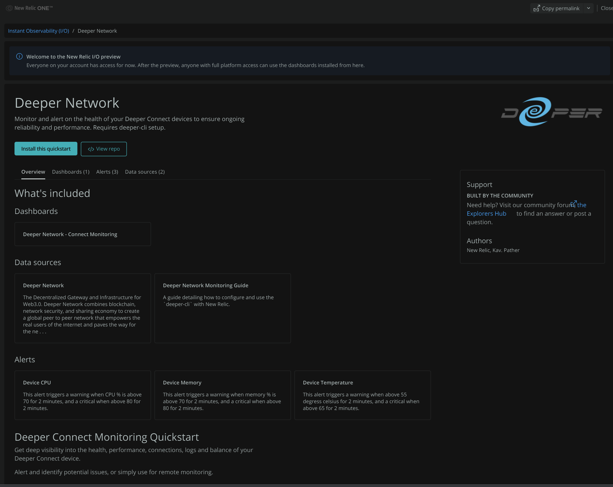

# Deeper Connect Monitoring Guide

This guide is intended to show you how to best monitor your Deeper Connect device using the Deeper CLI utility and if you'd like, also take advantage of New Relic's platform for complete observability allowing you to proactively protect and monitor your Deeper Connect investment (all for free!). Your Deeper Connect device is also an officially listed entity/network device in the New Relic platform, which is powered by the `deeper-cli` utility.

If you need help, feel free to find me in the Deeper Network Telegram (Kav), raise a [GitHub issue.](https://github.com/Kav91/deeper-connect-monitoring/issues/new) or connect with me on [LinkedIn.](https://www.linkedin.com/in/kav-pather/)

This project and guide will never ever ask for your wallet key or mnemonic. You are being scammed if you are! Only trust links from this guide!

### Table of contents:
- [So what do you get?](#What-do-you-get)
- [What is the Deeper CLI?](#What-is-the-Deeper-CLI)
- [Why New Relic (NR)?](#Why-New-Relic?)
- [Lets get started!](#Getting-Started)
- [Deeper CLI Packages](#Deeper-CLI-Packages)

---

## What do you get?
- Everything below for free!
  - Secure logs & metric backup
  - Secure remote monitoring
  - Alerts with prebuilt and customizable dashboards
  - Monitor multiple devices at scale and group into workloads (great for rig builders!)
  - Access to the [Deeper CLI]((#What-is-the-Deeper-CLI))
  - Probably some other stuff...

  
  
  
  
  
  
  

---

## What is the Deeper CLI?
The Deeper CLI is a command line utility developed in Rust (The same language Deeper Chain is developed in!) that interfaces with the APIs of your Deeper Connect device. It provides a fast and programmatic way of quickly reading, capturing and backing up your devices data. This utility only outputs data to standard out (your terminal output) or to the New Relic Event API if enabled. 

Authentication is handled identically to how you log into Atmos Web UI, your password is encrypted and never stored in plain text anywhere. This is safer then storing it in your browsers inbuilt credential manager that stores it in plaintext which can be compromised easily.

---
## Why New Relic?
If you choose to also backup your metrics and logs to New Relic it is worth acknowledging a few key points.
- It's free! With 100GB of ingest per month! [see pricing here](https://newrelic.com/pricing) or quickly sign up to the [free edition here.](https://newrelic.com/signup)
- Your Deeper Connect device is considered a first class entity in the platform, the same class as a Cisco network device, AWS Load Balancer, CDN, Kubernetes Cluster, Database etc. No other observability platform offers this for Deeper Connect devices.
- The platform meets riguorous security compliance eg. FedRAMP, AICPA/SOC2, GDPR etc. [See compliance certifications](https://newrelic.com/security/compliance-certifications).
- Has some of the biggest customers you use everyday, eg. BBC, Disney, Ford, Sony, Riot Games, Fortnite/Epic Games. Refer: [Link 1](https://newrelic.com/customers), [Link 2](https://newrelic.com/press-releases/20130813).
- Highly scalable & performant platform that offers extreme flexibility, read more [here.](https://docs.newrelic.com/docs/telemetry-data-platform/get-started/nrdb-horsepower-under-hood/)
- After Google, New Relic's browser agent which provides some similar and differing set of capabilities is the most used RUM agent globally, see [Built With's usage distribution across the internet data](https://trends.builtwith.com/analytics/application-performance/traffic/Entire-Internet), and [reasons why NR is the most deployed RUM tool.](https://newrelic.com/blog/how-to-relic/three-reasons-new-relic-browser-dominates-the-internet)
- You can improve parts of the integration by contributing as its open source!
    - [The prebuilt entity dashboard.](https://github.com/newrelic/entity-definitions/tree/main/definitions/ext-deeper_connect)
    - [The quickstart which includes alerts and another dashboard.](https://github.com/newrelic/newrelic-quickstarts/tree/main/quickstarts/deeper-network)

---
# Getting Started

- If you just want a quick guide on how to use the CLI then view the [CLI usage documentation here.](./cli-usage)

- If you care about your investment in the Deeper Network and want the best monitoring possible for your device follow the [New Relic Setup](#new-relic-setup) below which will cover the entire process.

## New Relic Setup
- You will require a Windows or Linux (mac available but untested) device to setup the Deeper CLI to remotely monitor your Deeper Connect device. This device needs to remain on to collect data from your Deeper Connect device to ship to New Relic.

- You will be able to view all your data and dashboards from anywhere in the world within New Relic once setup.

- ARM devices such as Raspberry Pi's are also supported with the Linux ARM package.

- A Mac (darwin) distribution is available, but untested with the New Relic setup although will more then likely work.

 1. [Sign up to New Relic](./newrelic/1.signup.md)
 2. [Infrastructure agent install](./newrelic/2.infra-install.md)
 3. [Create a User API Key for your account](./newrelic/3.create-user-key.md)
 4. [Create a Insert API Key for your account](./newrelic/4.create-insert-key.md)

With the above information collected, you may use the automated setup (recommended).
|Automated (recommended) | Manual|
|------------------------|-------|
| 5. [Deeper CLI automated setup](./newrelic/5a.automated-setup.md#Automated-Deeper-CLI-Installation)  | 5. [Deeper CLI manual setup](./newrelic/5b.deeper-cli-setup.md) |
| 6. No step 6 :)                                             |   6. [Capture Logs & Connection Data](./newrelic/6.logs-connection-data.md) | 

 ---
 7. [View Logs](./newrelic/7.view-logs.md)
 8. [Setting up alerts](./newrelic/8.alerts.md)
 9. [Viewing all your data](./newrelic/9.viewing-data.md)

 If you've completed all the above steps, congratulations you're now what we call a DataNerd :)

 ### Advanced topics
 
 - What the best way to monitor multiple connect devices from one host?
    - If your host can access each Deeper Connect device on a different address/port you can specify in your config `DEEPER_CONNECT_URL` with a different URL.
    - Other options include using route tables
    - If you can access each device on a different address then;
      - Do the CLI authentication step again and also supply `--deeper-connect-url http://anotherconnectdevice.blah` This will generate an encrypted credential for this connect device.
      - Follow from Step 5. again and use a new file name (it can be anything), also supply the DEEPER_CONNECT_URL under the env block in all sections as well.
- I've got ideas to improve the prebuilt dashboards and alerts?
    - Good news, this is open sourced and you can contribute to either of these projects.
      - [The prebuilt entity dashboard.](https://github.com/newrelic/entity-definitions/tree/main/definitions/ext-deeper_connect)
      - [The quickstart which includes alerts and another dashboard.](https://github.com/newrelic/newrelic-quickstarts/tree/main/quickstarts/deeper-network)

## Deeper CLI Packages
Latest version: 0.2.0

- [deeper-cli-windows-x86_64-0.2.0.zip](https://deeper-network.s3.amazonaws.com/deeper-cli/deeper-cli-windows-x86_64-0.2.0.zip)
- [deeper-cli-linux-x86_64-0.2.0.tar.gz](https://deeper-network.s3.amazonaws.com/deeper-cli/deeper-cli-linux-x86_64-0.2.0.tar.gz)
- [deeper-cli-linux-armv7-0.2.0.tar.gz](https://deeper-network.s3.amazonaws.com/deeper-cli/deeper-cli-linux-armv7-0.2.0.tar.gz
)
- [deeper-cli-apple-darwin-x86_64-0.2.0.tar.gz](https://deeper-network.s3.amazonaws.com/deeper-cli/deeper-cli-apple-darwin-x86_64-0.2.0.tar.gz
)