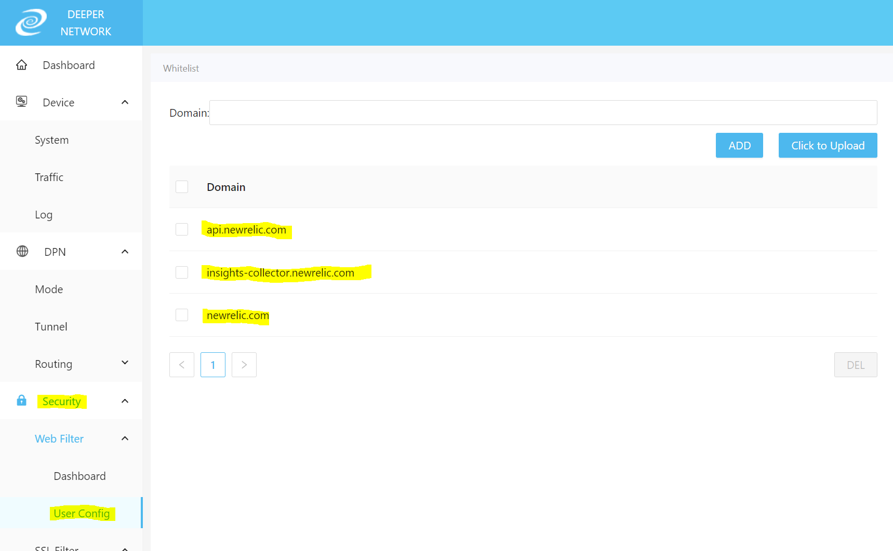

# [New Relic - Sign up to the free edition](https://newrelic.com/signup)

Prerequisite: 
  - Whitelist `newrelic.com` and `api.newrelic.com` in your Deeper Connect [Atmos web ui](http://11.22.33.44/webFilterConfig). By default your Deeper Connect incorrectly blocks outbound traffic to New Relic's data ingest APIs. 

- With the above done, proceed to signup!

[https://newrelic.com/signup](https://newrelic.com/signup)

- You will only require your name and email, no credit card information is required :)
- You will then receive an email verification, click the link to verify and proceed to next step.
- I would suggest having your account in the US region regardless of your location, as the data is only for yourself. The US region generally will receive new product updates first.
- After your account has been generated you will be immediately taken to the installation plan page.

## [Continue to step 2](./2.infra-install.md)