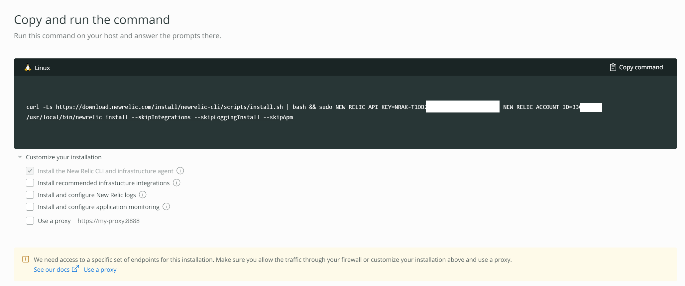
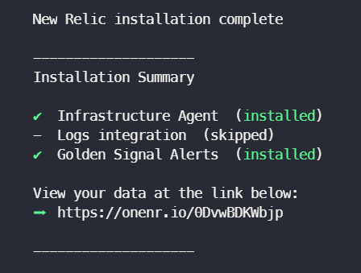
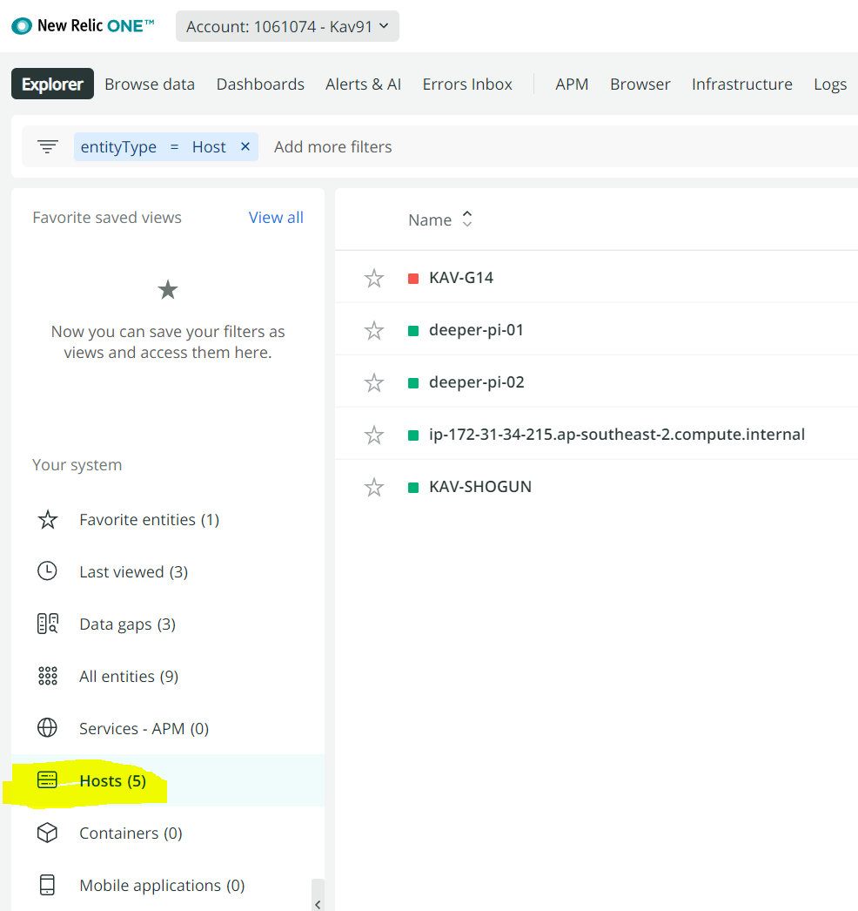

# Installation plan

- If you have accidentally closed the installation plan page, you can simply click "Install New Relic" on the splash, or click Add more data/Add some data and select the Guided install method.
    - Alternatively try one of these links:
      - [US Guided Install](https://one.newrelic.com/launcher/nr1-core.explorer?pane=eyJuZXJkbGV0SWQiOiJucjEtY29yZS5saXN0aW5nIiwiZmF2b3JpdGVzIjp7InNlbGVjdGVkIjp0cnVlLCJ2aXNpYmxlIjp0cnVlfSwibGFzdFZpZXdlZCI6eyJzZWxlY3RlZCI6ZmFsc2UsInZpc2libGUiOnRydWV9fQ=&cards[0]=eyJuZXJkbGV0SWQiOiJucjEtaW5zdGFsbC1uZXdyZWxpYy5ucjEtaW5zdGFsbC1uZXdyZWxpYyIsImFjdGlvbkluZGV4IjoxLCJwYXRoIjoiZ3VpZGVkIn0=)
      - [EU Guided Install](https://one.eu.newrelic.com/launcher/nr1-core.explorer?pane=eyJuZXJkbGV0SWQiOiJucjEtY29yZS5saXN0aW5nIiwiZmF2b3JpdGVzIjp7InNlbGVjdGVkIjp0cnVlLCJ2aXNpYmxlIjp0cnVlfSwibGFzdFZpZXdlZCI6eyJzZWxlY3RlZCI6ZmFsc2UsInZpc2libGUiOnRydWV9fQ=&cards[0]=eyJuZXJkbGV0SWQiOiJucjEtaW5zdGFsbC1uZXdyZWxpYy5ucjEtaW5zdGFsbC1uZXdyZWxpYyIsImFjdGlvbkluZGV4IjoxLCJwYXRoIjoiZ3VpZGVkIn0=)

The New Relic Infrastructure Agent and Deeper CLI will need to be installed on a system that is within the same network your Deeper connect device is in, which will generally be within your home anyway.
- Select your desired operating system (Windows, Linux or Mac)
- Then click `Begin installation`
- On the next pane, do not run the command straight away, click `Customize your installation` beneath and uncheck all the options. If you are using a proxy then enable it.
- Click `Copy command` in the top right of the command and paste into your shell/console/command prompt to run.

- You may be prompted during installation, follow them through.
  - If prompted, Golden signal alerts will be the first option, this will setup some default alerts for your host. This is optional however I suggest doing this.
  - If you selected yes, the next option will ask if you would like to be notified by email. Hit enter to select Yes.
- If completed successfully, you will have something that looks like the below output which includes a link to your entity (host). You can follow the link to see a prebuilt dashboard of your hosts performance.

- In the New Relic UI you were stepping through you will now have an option to click "See your data". This will take you to the entity explorer. Click "Hosts" in the bottom left if not already selected and it will show you a list of your hosts where the Infrastructure agent has been installed.

- Clicking your host will provide additional drill down data.
- If you have reached this step, then well done! You are now official monitoring your computer/host/server!
- We will continue the Deeper CLI installation later :)

## Note on ARM devices eg. Raspberry Pi's
- From version 1.20.6 of the Infrastructure Agent the log forwarder has been included which supports the below
    - arm64: Amazon Linux 2, CentOS 7 & 8, Ubuntu 16.04, 18.04 & 20.04, Debian 8, 9 & 10
- If not in the list you can follow the below to manually install the log forwarder
    - https://discuss.newrelic.com/t/forward-your-logs-with-the-infrastructure-agent-in-arm/157165

## [Continue to step 3](./3.create-user-key.md)
