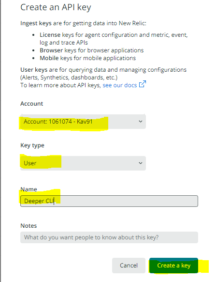

# New Relic - Create a User API Key for your account

We need some API keys to help facilitate the transfer of data.

When logged into your New Relic account, go to the API keys page or visit this link ->
[https://one.newrelic.com/launcher/api-keys-ui.launcher](https://one.newrelic.com/launcher/api-keys-ui.launcher)

This key will be used for querying New Relic itself to help us stitch data together.
- Click 'Create a key' (towards top right)
- Select your account
- Key type: User
- Name: Deeper CLI
- Notes: Anything you want to add

After creation save the key somewhere, or revist the page again to copy the key from here again when required later.

## [Continue to step 4](./4.create-insert-key.md)